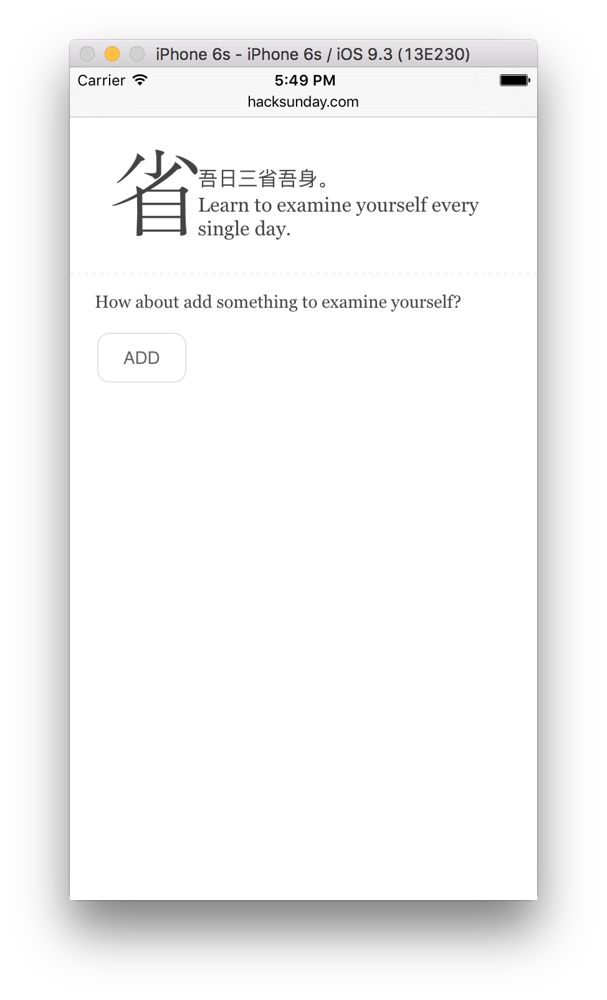
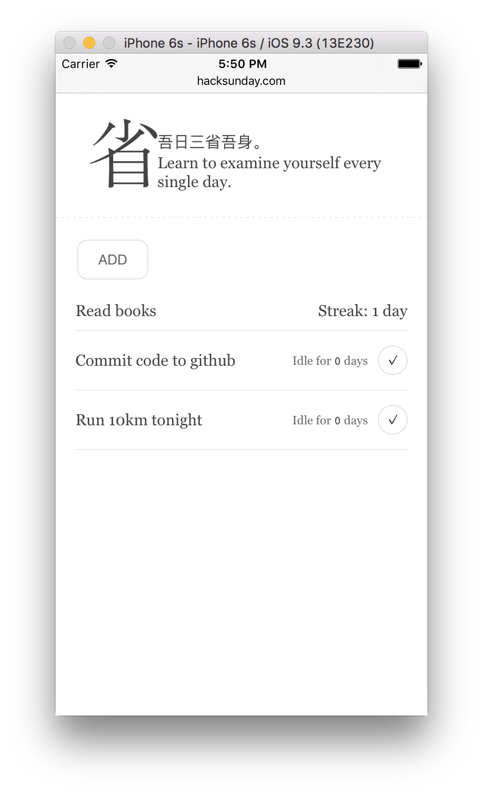

---

> Master Tseng said, Every day I examine myself on these three points:
> In acting on behalf of others, have I always been loyal to their interests?
> In intercourse with my friends, have I always been true to my word?
> Have I failed to repeat the precepts that have been handed down to me?

## Feature

- Add target easily
- Track your targets in a list
- Store data locally

## Develop

1. Clone the repository: `git clone git@github.com:HackSunday/examine-self.git`
2. Install dependencies: `npm i`
3. Run the app: `npm start` (it will automatic open browser and load the app)

---

- Run `npm run bunlde` to get the bundled file

## Screeshot

## License

The MIT License
